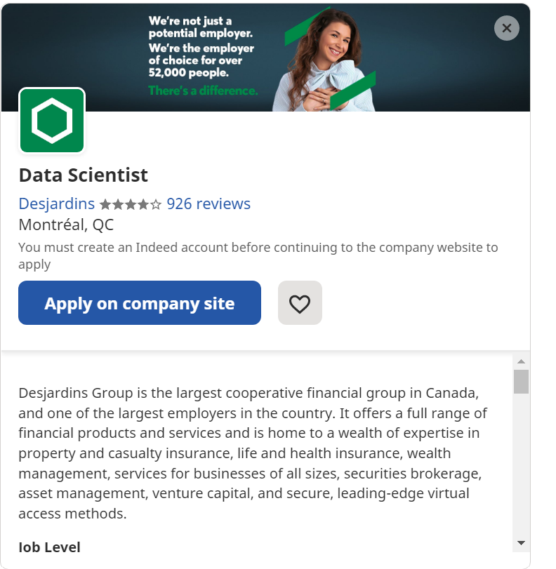
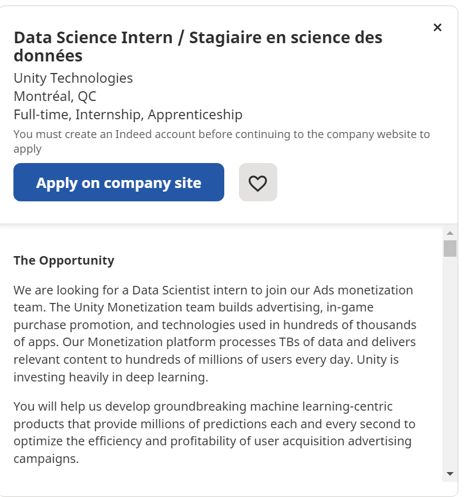
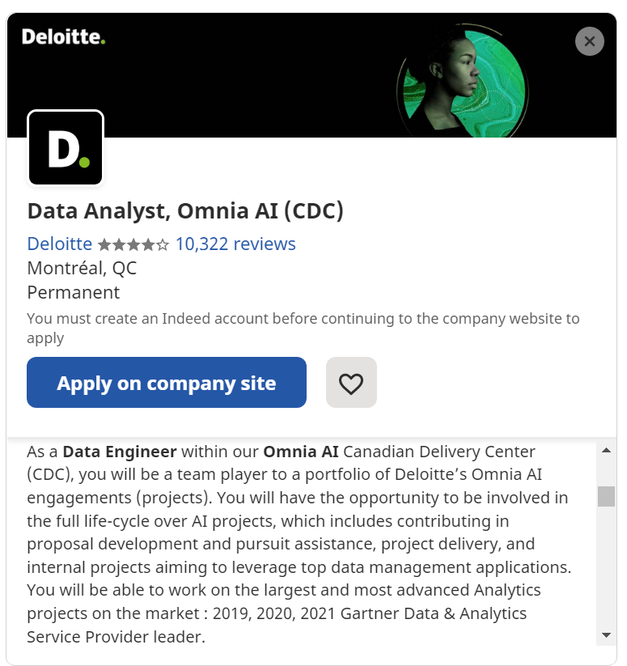

# Task 1: Data Science Careers

I'm interested in the desjardins job because it seems very applicable to what we learned in this course in terms of the data science porject life-cycle. The Unity job posting seems interesting because it involves more AI/ML which would be interesting to learn about. Also the application of AI/ML to actually increase profits of the company would be really neat. The Deloitte posting seems to be a good mix of the other two postings (AI/ML and full project life-cycle).

# Task 2: Highs and Lows

1.  I really enjoyed the homework assignments how it was up to us to read documentation about our specific tasks.

2. There was a bit of confusion with every assignment that resulted in many discussion posts for each assignment. It would have been extremely helpful if the TAs started sending the HW clarification emails earlier in the semester! Also it would be great if you could reach out to McGill admin and AWS about making McGill an AWS educate partner institution :)

3. NA